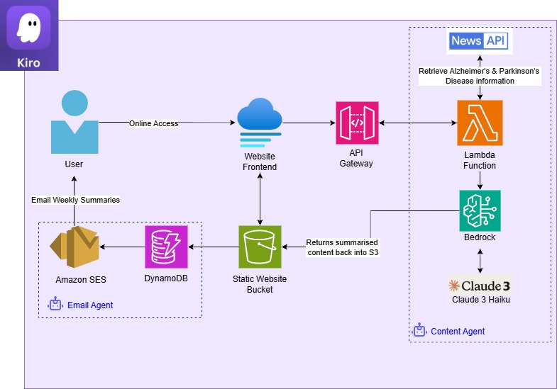

# Alkinson's Newsletter
An AI-powered system that automatically curates and summarizes the latest Alzheimer's and Parkinson's disease research, made available on a website. Users who subscribe can receive weekly updates via newsletter. 

## Inspiration
Alzheimer's disease and Parkinson's disease are the two most common neurodegenerative diseases in the elderly; many of us are familiar with a patient in the family. Keeping an eye on the latest breakthroughs and developments in this area could help us better understand the disease and potential opportunities to improve how we can assist our loved ones.

Staying up to date with current research and development on both diseases is hindered by the overwhelming amounts of articles published weekly. Hence Alkinson was created to automatically search and summarise the latest research articles and findings on both diseases and publish them onto an easily accessible website.

**Architecture Diagram**

**Demo Video Link:** https://www.youtube.com/watch?v=dyFK7BZm_j0

## What it does

Alkinson is an accessible static website that provides weekly updates on both Alzheimer's and Parkinson’s disease. Subscribed users would get emailed weekly summaries on Monday of each week detailing scientific updates that have occurred in the research realm/general news on the disease.

## How this was built

AWS Kiro was the amazing tool behind this that helped build this agentic solution. There are two AI agents working seamlessly behind the scenes. One is the content agent, and the other is the email agent.

Firstly, the content agent utilises a Lambda Function to call NewsAPI and retrieve relevant articles on both diseases. Bedrock’s Claude 3 Haiku LLM model is then leveraged to summarise these articles into a simplified form. The results of this summarisation is stored in an S3 bucket for the website’s backend.

Secondly, the email agent will then orchestrate sending weekly emails using AWS SES to subscribers which are stored in DynamoDB. Please note that due to time constraints, the email agent will be delivered at a later stage.

## **Challenges**

- **Time Constraints:** Due to other commitments, the email agent was partially built.
- **Finetuning LLM Responses**: The prompt for Claude 3 Haiku had to be adjusted multiple times to produce an accurate output.
- **Kiro's Errors:** Kiro ran into an error midway throughout execution and did not respond to any prompt. It was resolved after multiple retries by opening a new window.

## **Accomplishments**

- Kiro massively assisted with developing and completing the project. It was efficient, quickened the development process and was a great opportunity to expand knowledge.
- Developing multiple AI agents that interact with each other and other AWS Services via Lambda functions.

## **What we learned**

- The value of AI integration in developing software by leveraging Kiro in development, it was an incredible assistant and massively quickened the process.
- The power of multiple agents working together to not only connect different AWS services together, but to create a project that is not only simple but helpful.

## **What's next for Alkinson**

- Completing the email agent
- Expand coverage to other diseases
